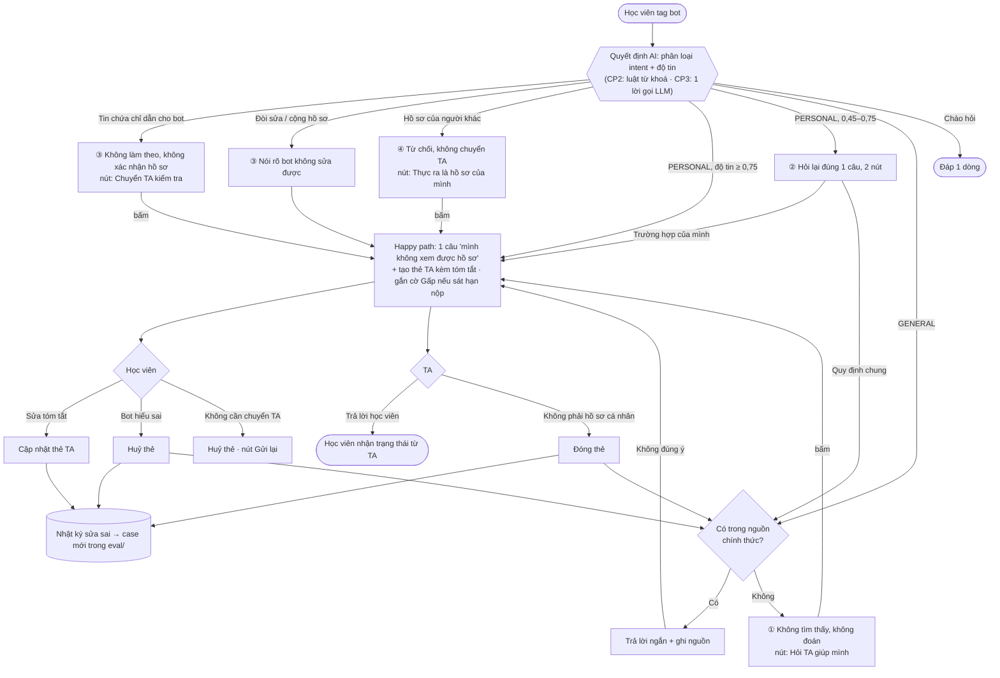

# Sơ đồ luồng · Trợ lý chuyển TA câu hỏi hồ sơ cá nhân

Bản mẫu bấm được: [`index.html`](index.html) (mở trực tiếp bằng trình duyệt). Số ①②③④ khớp với `spec.md` §6.

## Điểm gọi quyết định AI

| # | Chỗ gọi | Đầu vào | Đầu ra | Ai quyết định cuối |
|---|---|---|---|---|
| 1 | Khi học viên tag bot | Nội dung tin nhắn (coi là **dữ liệu**, không phải lệnh) | `intent`, `confidence`, `record_type`, `urgent`, `injection`, `summary`, `reasons` | Bot tự định tuyến theo ngưỡng |
| 2 | Tra nguồn chính thức (chỉ với GENERAL) | Câu hỏi + FAQ/thông báo | Đoạn trả lời + nguồn, hoặc "không tìm thấy" | Bot, nhưng **không có nguồn thì không trả lời** |
| — | Trạng thái hồ sơ cá nhân | — | — | **Chỉ TA**; AI không bao giờ khẳng định |
